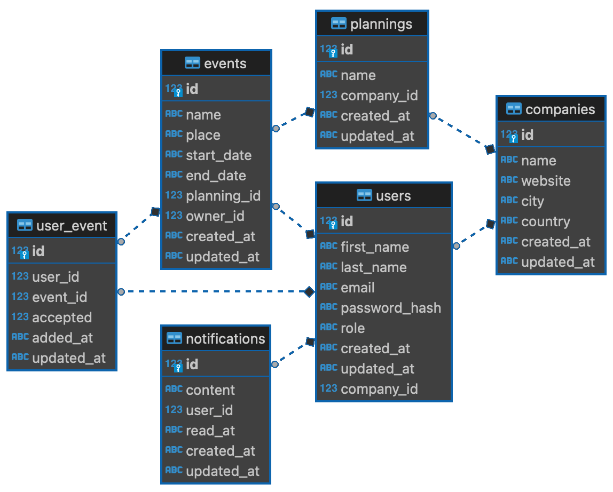

# Company +

🙌 __Python FastAPI Company+ API__ 🙌

Made by Jules Ladeiro for school project in Python with FastAPI!

## Setup

Install python <= 3.11.2, or install docker.

If you choose to install python, don't forget to install the requirements.

```bash
pip install -r requirements.txt
```

### Run with Docker

```bash
docker-compose up --build
```

### Run with Uvicorn (python)

```bash
uvicorn main:app --reload
```

## Swagger Documentation

<http://localhost:8080/docs>  (docker installation default port)

<http://localhost:8000/doc> (python installation default port)

## Authentication

Don't forget to authenticate yourself to use the API, only the /login route is public.

Please note that when you will authenticate yourself, you will have to enter your email in the `username` field and your password in the `password` field.

## Database information

### By default

The database is sqlite. It's recommended to use the default database with testable datas, but you can use another database or delete the default one if you want.

It is located in the `app/db` folder, and its default name is `companyplus.db`.

### Tables



- [x] users
- [x] companies
- [x] plannings
- [ ] events
- [ ] notifications

Below sections are the tables with their columns and some example content that are in the default database (companyplus.db).

Please refer to the following table to understand the meaning of the characters in the database tables.

| character | meaning             |
| --------- | ------------------- |
| #         | hashed field        |
| ?         | optional field      |
| !         | encrypted field     |
| *         | any / unknown value |

#### Users table

| id  | first_name! | last_name! | email!         | password#  | role       | company_id |
| --- | ----------- | ---------- | -------------- | ---------- | ---------- | ---------- |
| 1   | *           | *          | admin@cp.cp    | admin      | MAINTAINER | 1          |
| 2   | *           | *          | jules@jules.ju | azerty     | ADMIN      | 1          |
| 3   | *           | *          | loic@py.py     | azertyuiop | USER       | 1          |
| 4   | *           | *          | yan@yan.yan    | azertyuiop | ADMIN      | 2          |
| 5   | *           | *          | adam@ad.am     | azertyuiop | USER       | 2          |
| 6   | *           | *          | hugo@hu.go     | azertyuiop | USER       | 3          |
| 7   | *           | *          | hakim@hakim.ou | azertyuiop | ADMIN      | 3          |

#### Companies table

| id  | name!       | website!? | city! | country! | member_ids |
| --- | ----------- | --------- | ----- | -------- | ---------- |
| 1   | companyplus | *         | *     | *        | 1,2,3      |
| 2   | sportplus   | *         | *     | *        | 4,5        |
| 3   | twitterplus | *         | *     | *        | 6,7        |

#### Plannings table

| id  | name!        | company_id |
| --- | ------------ | ---------- |
| 1   | Dev backend  | 1          |
| 2   | Dev frontend | 1          |
| 3   | Dev shop     | 2          |
| 4   | Marketing    | 3          |

#### Events table

| id  | name! | place! | start_date | end_date | planning_id | member_nb | owner_id |
| --- | ----- | ------ | ---------- | -------- | ----------- | --------- | -------- |

#### Notifications table

| id  | content! | user_id | read_at |
| --- | -------- | ------- | ------- |

## Evaluation grid

### 1. Structure du projet et organisation du code (35 points)

- [x] README.md clair et bien documenté (sachant qu'un README ne me permettant pas d'exécuter le code entrainera une réduction de la note globale de 33%) (5 points)
- [x] Organisation des fichiers et dossiers (5 points)
- [x] Utilisation appropriée des modules et packages (5 points)
- [ ] Lisibilité et propreté du code (10 points)
- [ ] Commentaires lisibles et faisant sens (5 points)
- [x] Bonne utilisation du git (commits de bonne taille, messages faisant sens) (5 points)

### 2. Implémentation des standards appris en cours (35 points)

- [x] Utilisation de pydantic (5 points)
- [x] Section d'import bien formaté (system, libs, local), et chemins absolus et non relatifs Requirements.py avec versions fixes (5 points)
- [x] Définition du type de donnée en retour des fonctions. (5 points)
- [x] Bonne utilisation des path & query parameters (10 points)
- [x] Retour des bons codes HTTP (10 points)

### 3. Implémentation des fonctionnalités demandées (85 points)

- [x] Connexion à la base de données (30 points)
- [x] Gestion des utilisateurs (15 points)
- [x] Gestion des plannings (15 points)
- [ ] Gestion des activités (15 points)
- [x] Gestion des entreprises (10 points)

### 4. Sécurité (20 points)

- [x] Utilisation de tokens pour l'authentification (JWT) (5 points)
- [x] Validation et vérification des données entrantes avec modèles pydantics, not (5 points)
- [ ] Gestion des erreurs et exceptions (5 points)
- [x] Sécurisation de la connexion à la base de données (5 points)
